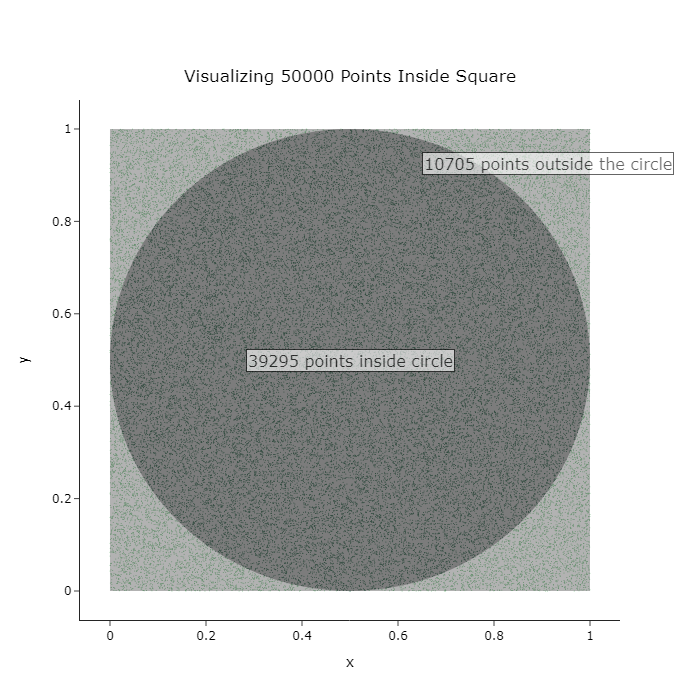
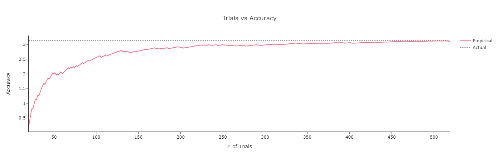

# Estimating π through Monte Carlo Simulations

## What's Monte Carlo?
Monte Carlo is a statistical method to estimate the relies on random sampling to generate the probability of outcomes. This relies on randomness to solve deterministic problems.

The name references the famous [Monte Carlo Casino](https://en.wikipedia.org/wiki/Monte_Carlo_Casino) in Monaco, alluding to the randomness involved in the games played there.

Metropolis, N., & Ulam, S. (1949). The Monte Carlo Method. *Journal of the American Statistical Association, 44*(247), 335–341. https://doi.org/10.2307/2280232

<p align="center">
  
  <br>
  <em>Figure 1: Monte Carlo is the answer.</em>
</p>

## How to estimate π using that?
### But, why does this work?
It's because the randomly generated points are uniformly distributed over the area of the square and the proportion of points inside the circle is representative of the circle's area relative to the square's area.

With more trials, the experiment probability will converge towards the theoretical probability.

### Steps to get the Pi

- Draw a square of side 1 pt circumscribing a circle (of diameter 1 pt)
Now imagine throwing paintballs forcefully at the square. How many of them fall inside the circle?
- Calculate the number of points inside the circle. You now know what proportion of points fall inside the circle.
- Multiplying that ratio with 4 gives you an approximation of Pi.

Remember, more the points you throw, the better the model approximates.

## Code

`Points` is the class used for the experiment.

```bash
  class Points:
    def __init__(self, trials = 100, radius = 0.5, xRange = [0, 1], yRange = [0, 1]):
        self.points = [self.randomPoint(xRange, yRange) for _ in tqdm(range(trials), desc='Generating Points')]
        self.df = pd.DataFrame(self.points, columns=['x', 'y'])
        self.df['inside'] = self.df.apply(lambda x: self.pointInsideCircle(x, radius), axis = 1)
    
    def randomPoint(self, xRange, yRange):
        return [random.uniform(xRange[0], xRange[1]),
                random.uniform(yRange[0], yRange[1])]
    
    def pointInsideCircle(self, point, radius):
        return (point.iloc[0] - radius)**2 + (point.iloc[1] - radius)**2 <= radius**2
```
## Results
With 10 million randomly generated trials, the value of pi is approximated to be __3.1418212__

$$\begin{equation}
\pi \approx 4 \cdot \frac{P_{\text{inside}}}{P}
\end{equation}$$

where <br> $P_{\text{inside}}$ is the number of points inside the circle
<br> $P$ is the total number of points (or trials)


<p align="center">
  
  <br>
  <em>Figure 2: Simulation results for 50000 data points.</em>
</p>

### Trials vs Accuracy
By the law of large numbers, the estimation accuracy increases considerably with number of trials. Pictured here is only the initial 500 results of the experiment.
<p align="center">
  
  <br>
  <em>Figure 3: Trials vs Accuracy.</em>
</p>


